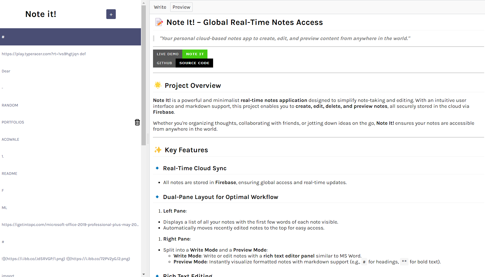
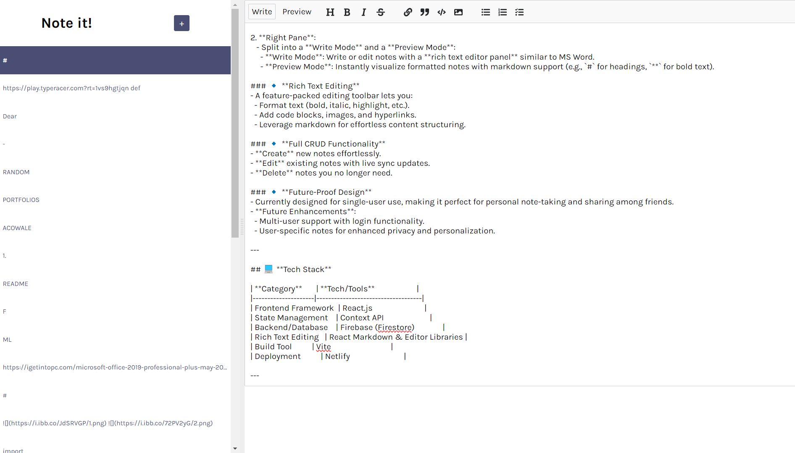

# 📝 **Note It! – Global Real-Time Notes Access**  

> **_"Your personal cloud-based notes app to create, edit, and preview content from anywhere in the world."_**

---

[](https://hailex.netlify.app/)  
[](https://github.com/Hailex798/NOTE-IT)

---

## 🌟 **Project Overview**  

**Note It!** is a powerful and minimalist **real-time notes application** designed to simplify note-taking and editing. With an intuitive user interface and markdown support, this project enables you to **create, edit, delete, and preview notes**, all securely stored in the cloud via **Firebase**.  

Whether you're organizing thoughts, collaborating with friends, or jotting down ideas on the go, **Note It!** ensures your notes are accessible from anywhere in the world.  

---

## 🎨 **Visual Overview**  

Get a glimpse of the **Note It!** interface and its core features:  

- **Left Panel**: Displays a list of all notes with a snippet of their content. Recently edited notes are automatically prioritized at the top.  
- **Right Panel**: Includes **Write Mode** powered by **ReactMDE** for editing notes and a **Preview Mode** for real-time markdown rendering.  

  
  

--- 

## ✨ **Key Features**  

### 🔹 **Real-Time Cloud Sync**  
- All notes are stored in **Firebase**, ensuring global access and real-time updates.  

### 🔹 **Dual-Pane Layout for Optimal Workflow**  
1. **Left Pane**:  
   - Displays a list of all your notes with the first few words of each note visible.  
   - Automatically moves recently edited notes to the top for easy access.  

2. **Right Pane**:  
   - Split into a **Write Mode** and a **Preview Mode**:  
     - **Write Mode**: Write or edit notes with a **rich text editor panel** similar to MS Word.  
     - **Preview Mode**: Instantly visualize formatted notes with markdown support (e.g., `#` for headings, `**` for bold text).  

### 🔹 **Rich Text Editing**  
- A feature-packed editing toolbar lets you:  
  - Format text (bold, italic, highlight, etc.).  
  - Add code blocks, images, and hyperlinks.  
  - Leverage markdown for effortless content structuring.  

### 🔹 **Full CRUD Functionality**  
- **Create** new notes effortlessly.  
- **Edit** existing notes with live sync updates.  
- **Delete** notes you no longer need.  

### 🔹 **Future-Proof Design**  
- Currently designed for single-user use, making it perfect for personal note-taking and sharing among friends.  
- **Future Enhancements**:  
  - Multi-user support with login functionality.  
  - User-specific notes for enhanced privacy and personalization.  

---

## 💻 **Tech Stack**  

| **Category**       | **Tech/Tools**                     |  
|---------------------|------------------------------------|  
| Frontend Framework  | React.js                          |  
| State Management    | Context API                       |  
| Backend/Database    | Firebase (Firestore)              |  
| Rich Text Editing   | React Markdown & Editor Libraries |  
| Build Tool          | Vite                              |  
| Deployment          | Netlify                           |  

---

## 🚀 **Live Application**  
Experience the live version here:  
🔗 [**Note It! – Live Demo**](https://hailex.netlify.app/)  

---

## 🏁 **Getting Started**  

Follow these instructions to set up and run **Note It!** locally on your machine:  

### 📋 **Prerequisites**  
Ensure you have the following installed:  
- **Node.js (v16 or later)**  
- **npm (v8 or later)**  

### ⚙️ **Installation**  
1. Clone the repository:  
   ```bash
   git clone https://github.com/Hailex798/NOTE-IT.git
   cd NOTE-IT
   ```  

2. Install the dependencies:  
   ```bash
   npm install
   ```  

3. Start the development server:  
   ```bash
   npm run dev
   ```  

4. Open your browser and navigate to:  
   **[http://localhost:5173](http://localhost:5173)**  

---

## 📖 **How It Works**  

The **Note It!** application is designed for simplicity and functionality:  

### **Write Section**  
- Compose or edit your notes using **ReactMDE (Markdown Editor)**, a rich text editor with built-in support for markdown syntax.  
- The editor includes a feature-packed toolbar, enabling you to:  
  - Format text (bold, italic, highlights).  
  - Insert code blocks, images, and hyperlinks.  
  - Utilize markdown shortcuts for structured content creation.  

### **Preview Section**  
- See a live preview of your markdown-formatted content in real time.  
- Perfect for creating professional, clean, and structured notes.  

### **Note List**  
- All your notes appear in a list view in the left pane.  
- Click on any note to edit it, and watch it move to the top of the list.  

---

## 🎯 **Future Enhancements**  

The project is designed with scalability and future improvements in mind:  
1. **Multi-User Support**:  
   - User-specific login for personalized note management.  
2. **Privacy and Security**:  
   - Restrict access to notes based on user authentication.  
3. **Collaborative Features**:  
   - Enable real-time collaboration on notes.  
4. **Improved Storage Options**:  
   - Add support for external databases or backup systems.  

---

## 🤝 **Contributing**  

We welcome contributions to enhance **Note It!**:  
1. **Fork the Repository**  
2. **Create a Feature Branch**:  
   ```bash
   git checkout -b feature-name
   ```  
3. **Commit Your Changes**:  
   ```bash
   git commit -m "Add feature X"
   ```  
4. **Push the Branch**:  
   ```bash
   git push origin feature-name
   ```  
5. **Open a Pull Request**  

---

## 📜 **License**  

This project is licensed under the **MIT License**. See the `LICENSE` file for more details.  

---

## 🌟 **Acknowledgments**  

Special thanks to:  
- **React** and **Firebase** communities for tools and libraries.  
- Open-source contributors for their guidance.  

> Created with ❤️ by [Hailex798](https://github.com/Hailex798).  
```